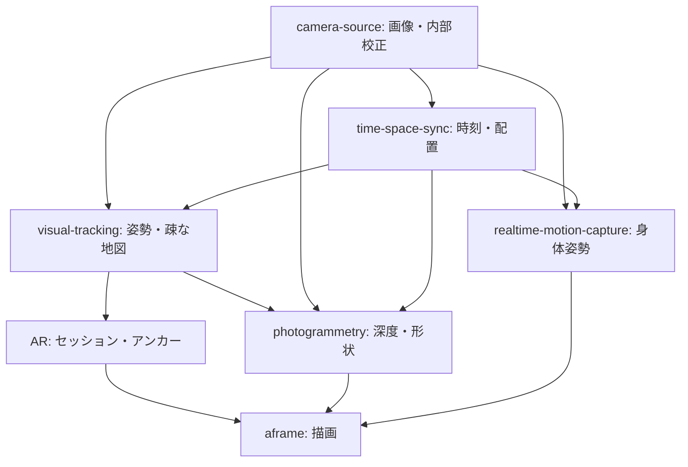

# TurboWarp-Photogrammetry

[日本語](README.ja.md)

Initial TurboWarp extension scaffold for photogrammetry. This repository is based on `turbowarp-extension-template` v0.4.0. The proposed runtime algorithms are not implemented yet.

## What it does

Currently provides only the template's `hello [NAME]` smoke-test block, a Vite bundle, an API manifest, tests and CI. It does not perform synchronization, tracking, or reconstruction.

## Planned implementation

See [the Japanese implementation proposal](README.ja.md) for responsibilities, dependencies, acceptance criteria and rollback. The proposal is also copied below so this entrypoint records the intended work.

### 目的

WebGPUによる逐次3D再構成を提供するTurboWarp拡張として開発する。

### 実装予定

- 校正済みステレオ画像を平行化し、信頼度付き深度を推定する。
- 推定姿勢を使って深度を逐次融合し、密な点群・局所メッシュを更新する。
- キーフレーム・メモリ上限・更新周期を管理し、保存・書き出しを提供する。

### パッケージ間の関係

- camera-source: 校正済み画像と撮影設定。
- time-space-sync: 時刻対応とrig配置。
- visual-tracking: 移動中の姿勢と疎な地図。
- photogrammetry-app: 移動撮影・品質案内・保存操作。aframe: 描画と投影設定の適用。

### 設計上の条件

最初は静止対象と固定ステレオrigを対象にする。COLMAP/OpenMVS全体の移植ではなく、WebGPUの深度・融合とWASMの幾何計算を組み合わせる。単眼、ループ補正後の再融合、全体最適化と高品質テクスチャは後続段階。

### 段階導入・受け入れ基準

1. 既存実装の所在・APIと校正形式を確認し、関連GitHub Issueでスコープを確定する。
2. 互換性を保った最小経路を実装する。新経路のフィーチャーフラグは既定OFFとし、導入時に設定場所を定義する。
3. 保存画像のオフライン再構成を比較基準に、深度誤差・形状誤差・処理遅延・長時間のメモリ使用量を測定する。追跡30Hz、形状更新5–10Hzは実機測定前の仮目標であり保証値ではない。
4. 単体検証に加えて実カメラによる統合検証を記録する。

### ロールバック

抽出元の旧経路を移行中は保持し、フラグOFFで切り戻す。保存済み校正形式の互換読取りを保持する。初期雛形にはアルゴリズムもフラグもまだ存在しない。

### タスク管理

この文書はローカルの提案草案。実装着手前に本リポジトリのGitHub Issuesへ依存・DoD・チェックリスト・start/done/blockedログを記録する。Issueの作成・投稿は今回の初期配置には含まない。

## Planned architecture



Arrows indicate provider → consumer. This is a proposal; these integrations are not implemented in the scaffold.

## Requirements and safety

Node.js >=22.18.0 and pnpm 11.11.0. The current sample runs sandboxed. Future camera/WebGPU integration requires an explicitly implemented unsandboxed runtime and capability checks. Published packages and hosted documentation are not available as part of this scaffold.

## Development

```bash
corepack enable
pnpm install --frozen-lockfile
pnpm run build
pnpm run typecheck
pnpm run lint
pnpm run test
pnpm run repo:check
```

Package identity: `@kubohiroya/turbowarp-photogrammetry@0.1.0` (local scaffold, not a published installation).
Bundle: `dist/photogrammetry.js`. Contract: `dist/extension-manifest.json`.

`pnpm run check` additionally checks generated files against Git. Run it after the initial files have been committed. No initial commit or remote publication is performed by scaffolding.

## Block reference

<!-- BEGIN GENERATED BLOCKS -->

### `hello [NAME]`

Returns a localized greeting for the supplied name.

| Property | Value |
|---|---|
| Type | Reporter |
| Opcode | `hello` |
| `NAME` | String, default: `world` |

<!-- END GENERATED BLOCKS -->

## License

MPL-2.0. See [LICENSE](LICENSE).
